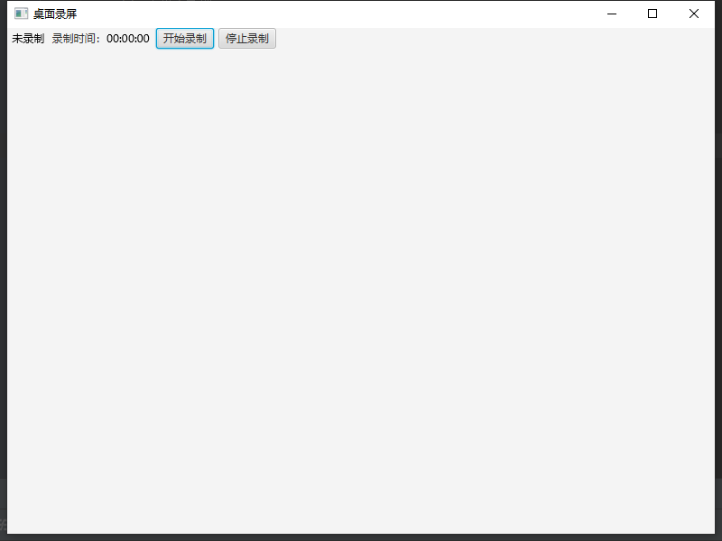

###基于Javacv的FFmpeg开发录屏工具
####简介
<b>Ekraani</b>是基于Javacv开发的录屏工具，主要功能是录制视频，支持H264编码，支持音频录制，支持视频录制时的截图功能。</br>
<b>UI</b>界面由javafx开发，界面简洁，功能单一。
####安装项目
克隆项目到本地
```
git clone https://github.com/ekraani/Ekraani.git
cd Ekraani
mvn clean install
mvn package
```
####使用说明
找到com.lf.app下的App，直接运行会出现操作界面

####界面
